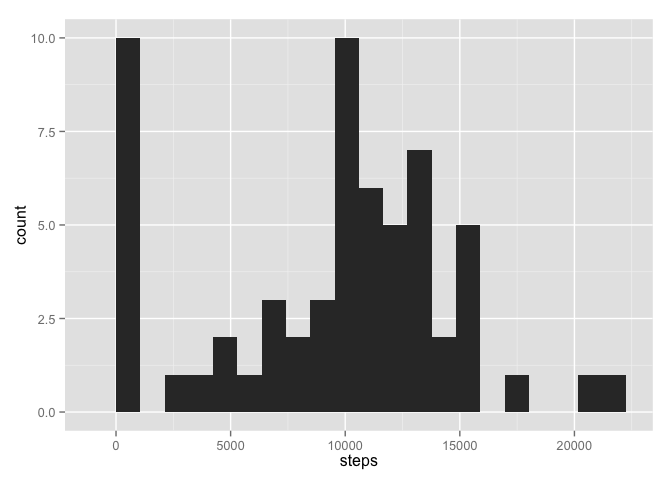
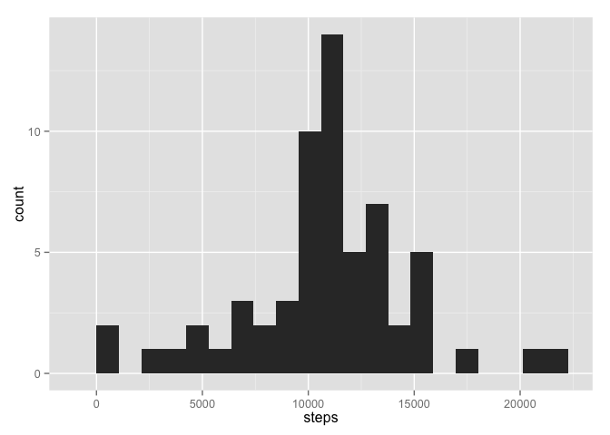

# Reproducible Research: Peer Assessment 1
H. David Shea  

## Loading and preprocessing the data

I want the activity data object to be a tbl class object for ease of use with dplyr 
and tidyr routines.  As such, I pull in the dplyr and tidyr libraries and - when reading
the data file - convert it to tbl class.


```r
library(dplyr, warn=F)
library(tidyr)
csvFName <- unzip("activity.zip",list = T)[1,"Name"] # determine internal filename
unzip("activity.zip",file=csvFName) # unzip data
activity <- tbl_df(read.csv(csvFName,stringsAsFactors = F)) %>%
    mutate(date=as.Date(date, format="%Y-%m-%d"))
rm(csvFName)
```

## What is mean total number of steps taken per day?

- Calculating total number of steps per day,
- Plotting a histogram showing the distribution of number of steps per day, and then
- Reporting mean and median number of steps per day over the full two months.


```r
library(ggplot2)
byDay <- activity %>%
    group_by(date) %>%
    summarise(steps = sum(steps, na.rm = T))

ggplot(byDay, aes( steps )) +
    geom_histogram(binwidth = max(byDay$steps)/20)
```

 

```r
dSummary <- summarise(byDay, Average = mean(steps), Median = median(steps))
dSummary
```

```
## Source: local data frame [1 x 2]
## 
##   Average Median
## 1 9354.23  10395
```

## What is the average daily activity pattern?

- Calculating average number of steps per interval across all days,
- Plotting a line chart showing the average daily activity pattern per 5 second 
interval over the days, and then
- Reporting the interval with - on average - the maximum number of steps during
the day.


```r
byInterval <- activity %>%
    group_by(interval) %>%
    summarise(steps = mean(steps, na.rm = T))

ggplot(byInterval, aes(interval, steps)) +
    geom_line()
```

 

```r
filter( byInterval, steps == max(byInterval$steps))
```

```
## Source: local data frame [1 x 2]
## 
##   interval    steps
## 1      835 206.1698
```

## Imputing missing values

Checking the impact of missing values on the results from above:

- Reporting how many missing values are in the data set:  there are 2304 NA observations out of 17568 total observations
- Using the average number of steps per interval over all days as a replacement for the NA values:  this is computed in the new object activityAdj
- Calculating total number of steps per day using adjusted data,
- Plotting a histogram showing the distribution of number of steps per day with the adjusted data, and then
- Reporting mean and median number of steps per day over the full two months with the adjusted data


```r
sum(is.na(activity$steps))
```

```
## [1] 2304
```

```r
activityAdj <- left_join(activity, byInterval, by="interval")
activityAdj <- bind_rows(
    filter(activityAdj, is.na(steps.x))  %>% select(steps=steps.y, date, interval),
    filter(activityAdj, !is.na(steps.x)) %>% select(steps=steps.x, date, interval))

byDayAdj <- activityAdj %>%
    group_by(date) %>%
    summarise(steps = sum(steps))

ggplot(byDayAdj, aes( steps )) +
    geom_histogram(binwidth = max(byDayAdj$steps)/20)
```

 

```r
dSummaryAdj <-summarise(byDayAdj, Average = mean(steps), Median = median(steps))
dSummaryAdj
```

```
## Source: local data frame [1 x 2]
## 
##    Average   Median
## 1 10766.19 10766.19
```

Using the above method of replacements for NA values has the mean number of steps per 
day moving from a value of 9354 without adjustments 
to a value of 10766 with the adjustments.  

Using the above method of replacements for NA values has the median number of steps 
per day moving from a value of 10395 without adjustments 
to a value of 10766 with the adjustments.  

## Are there differences in activity patterns between weekdays and weekends?

- Adding a new factor to the adjusted data set to indicate whether the day is a weekday
or a weekend
- Calculating average number of steps per interval across all days differentiating
between weekdays and weekends,
- Plotting a line chart showing the average daily activity pattern per 5 second 
interval over the weekdays and weekends in separate plots.


```r
activityAdj <- activityAdj %>%
    mutate(dtype = factor((weekdays(date)=="Saturday") | (weekdays(date)=="Sunday"),
                           labels=c("weekday","weekend")))

byIntervalAdj <- activityAdj %>%
    group_by(dtype,interval) %>%
    summarise(steps = mean(steps, na.rm = T))

ggplot(byIntervalAdj, aes(interval, steps)) +
    geom_line() +
    facet_wrap(~dtype, ncol=1)
```

 
